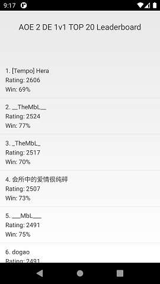
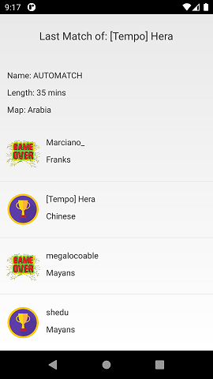

# AOE 2 DE Leaderboard

### Zadání
Napište aplikaci pro Android s libovolným UI o dvou obrazovkách, kde první bude zobrazovat leaderboard hráčů Age of Empires 2 DE. Druhá obrazovka bude vázaná ke konkrétnímu hráči z leaderboardu a bude zobrazovat detaily jeho poslední hry. Dokumentace veřejného api, které lze využít je na https://aoe2.net/#api.

1) Leaderboard bude pro režim 1v1 Random Map a bude obsahovat top 20 hráčů. U každého hráče zobrazena pozice,jméno,rating a procento vyhraných her. Ověření správnosti lze pomocí https://aoe2.net/#aoe2de-leaderboard-rm-1v1

2) V detailu poslední hry bude vidět jméno zápasu, délka zápasu v minutách, jméno mapy a seznam hráčů v daném zápase, kde každý bude mít : jméno hráče, jméno civilizace a indikaci, jestli daný hráč vyhrál nebo prohrál.
Ověření správnosti lze pomocí https://aoe2.net/#profile-xxxxxx

V aplikaci použijte libovolné technologie a knihovny.

### Přidané závislosti:
- com.loopj.android:android-async-http:1.4.9 - Klient pro vytvoření a vykonání REST requestů

### Návrh SW:
- Principy OOP: abstrakce, dědičnost, generalizace, interfacy, přetěžování, překrývání,..
- Android SDK: Activity + Intent, ASyncTask, SyncHttpClient, ConstraintLayout, Listview Adapter, XML Layouts

### Odhadovaná doba vývoje __3h__:
- Vytvoření UI: 1h
- Prostudování API a jeho propojení s UI: 2h

### Výsledná doba vývoje __7h__:
- Vytvoření UI, Propojení s requesty, Handlování postupu a chyb : 2h
- Vytvoření rozhraní pro REST requesty a jejich asynchronní vykonání: 2h
- Reprezentace dat, parsování z JSONu: 1.5h
- Prostudování API, Debugování, odstraňování chyb, ladění detailů,..: 1.5h

### Ukázka z aplikace:

